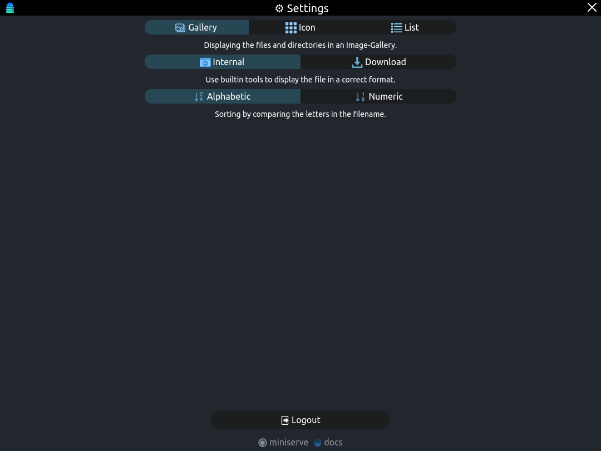
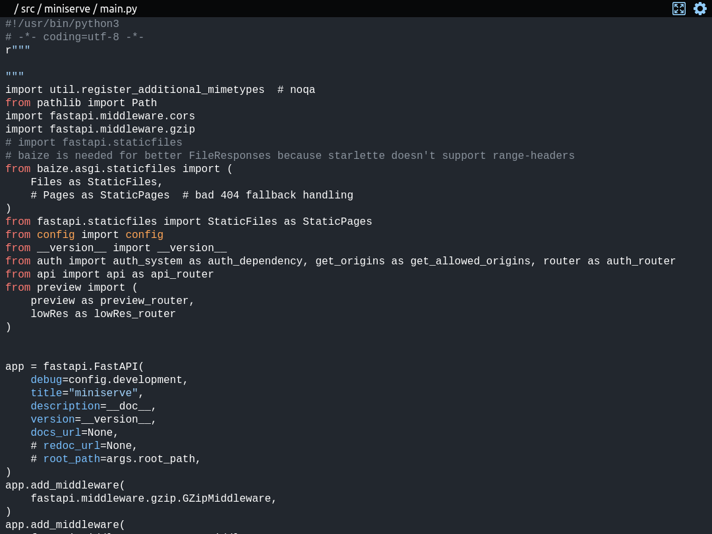

#  fileporter
Serve a directory in your local network for view over the browser

See [the documentation](https://fileporter.github.io/docs/) for more information.

# Example usage

```shell
user@pc:~/path/to/folder$ fileporter
<args {'host': '0.0.0.0', 'port': 8000, 'root': '.', 'username': 'user', 'auth': None, 'worker': 8, 'root_path': '/', 'uds': None, 'logs': None, 'dotall': False, 'dependencies': False, 'cache': True}>

                                 
    █▀▀▀▀▀█ ▀▀▀  ▄▄▀  █▀▀▀▀▀█    
    █ ███ █ ▄▄▀▄▄▄  ▀ █ ███ █    
    █ ▀▀▀ █ █▀▄▄ █▄▀  █ ▀▀▀ █    
    ▀▀▀▀▀▀▀ █ ▀▄▀ ▀▄▀ ▀▀▀▀▀▀▀    
    ▀  ▄▀ ▀▀█▀██▀▄▀▄█▀▀▀██ ▄▀    
    ▄▄██▀█▀ ▀▄▀██  ▀▄▀▄██▀█▄     
    █ ▄▄▄▀▀▄▀█▄▀▀▄▀▄█▀▀▀▄▀▀█▀    
      ▀▄▄█▀▀▀   ▄  ▀ ▀ ▄▄██▄     
    ▀▀ ▀ ▀▀▀▄ ▀▀▄▀█▀█▀▀▀█▀█      
    █▀▀▀▀▀█ ▀ ▄█▀█▀ █ ▀ ██▄      
    █ ███ █ ▀   ▀█▄ ▀███▀▄███    
    █ ▀▀▀ █   █ ▄ ▄█ ▀██▄▄▄█     
    ▀▀▀▀▀▀▀ ▀  ▀ ▀▀▀  ▀   ▀▀▀    
                                      
    http://10.20.30.40:8000
```






# ~~Development Notes~~

<!--
after the clone to complete the setup
```bash
ln -rs "$PWD/scripts/dev/pre-push" ".git/hooks/"
```
-->
